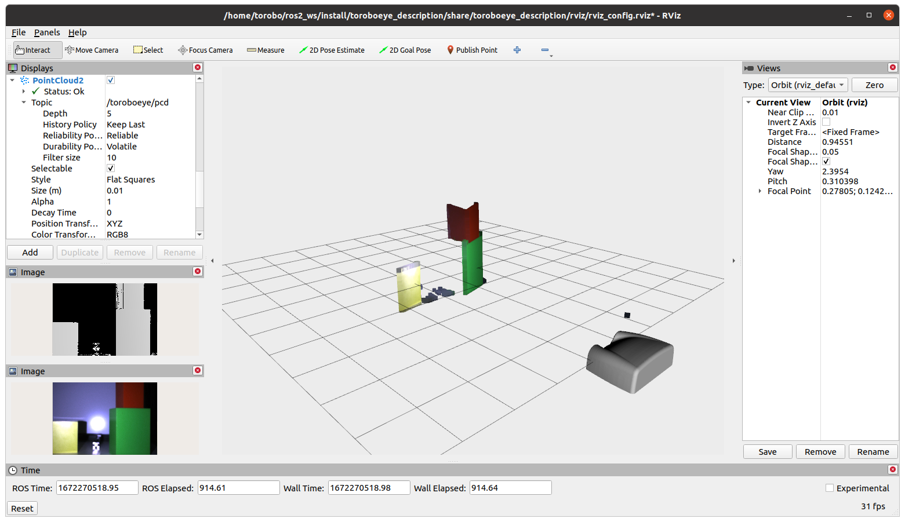

# Torobo Eye ROS2

The `toroboeye_ros2` provides a ROS2 interface for the [toroboeye](https://robotics.tokyo/ja/products/torobo_eye/).
<p align="center">
    
    
</p>

## Table of Contents
- [Torobo Eye ROS2](#torobo-eye-ros2)
  - [Table of Contents](#table-of-contents)
  - [Supported versions](#supported-versions)
  - [File system](#file-system)
  - [Installation](#installation)
    - [Pytoroboeye installation](#pytoroboeye-installation)
    - [ROS installation](#ros-installation)
      - [Install build essentials](#install-build-essentials)
      - [Install ROS Melodic Morenia](#install-ros-melodic-morenia)
      - [catkin_ws setup](#catkin_ws-setup)
      - [Clone toroboeye_ros](#clone-toroboeye_ros)
      - [Install necessary Package for toroboeye_ros](#install-necessary-package-for-toroboeye_ros)
    - [Build toroboeye](#build-toroboeye)
  - [Getting Started](#getting-started)
    - [Launch Rviz and toroboeye GUI](#launch-rviz-and-toroboeye-gui)
    - [Examples](#examples)
      - [Capture](#capture)
  - [License](#license)


## Supported versions
The recommended configuration is ROS2 Galactic Geochelone with Ubuntu 20.04.
This package has only been tested for the one recommended above. 

## File system
- `toroboeye_bringup`: A package that has launch file to start Torobo Eye ros applications.
- `toroboeye_camera`: A package that has services to control Torobo Eye.
- `toroboeye_description`: A package that has the configuration model infomation of Torobo Eye.
- `toroboeye_examples`: A package that has examples (currently only capture example is included) using ros service.
- `toroboeye_msgs`: A packages that defines Torobo Eye's original commands.
- `toroboeye_ros2`: A metapackage that put together all packages for ros.

## Installation

### Pytoroboeye installation
- You can use this package after you have finished to install pytoroboeye in your pc.
- If you don't have pytoroboeye package, Please contact us.

### ROS2 installation
This operation is unnecessary if ROS Melodic Morenia has already been installed.

#### Install ROS2 Galactic Geochelone
Install build essentials

```bash
sudo apt update -y
sudo apt install -y build-essential
sudo apt install -y python-dev
sudo apt install -y python-pip
```

Setup sources

```bash
sudo apt install software-properties-common
sudo add-apt-repository universe
sudo apt update && sudo apt install curl
sudo curl -sSL https://raw.githubusercontent.com/ros/rosdistro/master/ros.key -o /usr/share/keyrings/ros-archive-keyring.gpg
echo "deb [arch=$(dpkg --print-architecture) signed-by=/usr/share/keyrings/ros-archive-keyring.gpg] http://packages.ros.org/ros2/ubuntu $(. /etc/os-release && echo $UBUNTU_CODENAME) main" | sudo tee /etc/apt/sources.list.d/ros2.list > /dev/null
```

Install ROS2 Galactic Geochelone

```bash
sudo apt update
sudo apt upgrade
sudo apt install ros-galactic-desktop
sudo apt install ros-galactic-ros-base
sudo apt install ros-dev-tools
```


#### Create workspace
```bash
source /opt/ros/galactic/setup.bash
mkdir -p ~/ros2_ws/src
cd ~/ros2_ws
colcon build
source install/setup.bash
```

#### Clone toroboeye_ros2
```bash
cd ./src
git clone https://github.com/TokyoRobotics/toroboeye_ros2
```

### Build toroboeye_ros2
Please place the toroboeye_ros2 package under `~/catkin_ws/src/` below before doing the following operations.
The directory structure is as follows.
```
~/catkin_ws
           `--src
                 `--toroboeye_ros2
                      |--toroboeye_bringup
                      |--toroboeye_camera
                      |--toroboeye_description
                      |--toroboeye_examples
                      |--toroboeye_msgs
                      `--toroboeye_ros2
```

Please build with the following command.
```bash
cd ~/ros2_ws
colcon build
source install/setup.bash
```

## Getting Started
### Launch Rviz and toroboeye GUI

Launch toroboeye_bringup.launch, captured image and pointcloud publish node is started. also lanunched rviz and toroboeye gui.
you can cofirm captured image(color and depth) and pointcloud in rviz.

```bash
ros2 launch toroboeye_bringup bringup.launch.py model:=sl80
```

<p align="center">
    
</p>

You can use these topics for desired application (image processing and machine learning etc.).

| Topic Name                      |Type                     |Note                               |
|---------------------------------|-------------------------|-----------------------------------|
| `/toroboeye/camera/color/image` | sensor_msgs/Image       | publish color image encoded 'rgb8'.
| `/toroboeye/camera/depth/image` | sensor_msgs/Image       | publish depth image encoded '32FC1'.
| `/toroboeye/camera/camera_info` | sensor_msgs/CameraInfo  | publish camera parameter.
| `/toroboeye/camera/point_cloud` | sensor_msgs/PointCloud2 | publish point cloud.

Also, The parameters related to the camera are managed in some yaml files. A brief description of each parameter is given below.

- toroboeye_camera/params/param_capture_setting.yaml

| Parameter Name                   | Type(default : available range)      |Note                |
|-------------------------------|-----------|--------------------------------------------------|
| `device_ip_address`           | -       | set device ip address of toroboeye for desiring connection.
| `device_illuminant_power`     | 8 : 0~8 | see document pytoroboeye for detailed explanation.
| `device_illuminant_color`     | 2 : 2~5 | see document pytoroboeye for detailed explanation.
| `depth_cording_pattern_index` | 7 : 7~8 | see document pytoroboeye for detailed explanation.
| `depth_accuracy`              | 2 : 1~6 | see document pytoroboeye for detailed explanation.
| `depth_exposure_time`         | 1 : 1~6 | see document pytoroboeye for detailed explanation.
| `color_strobe_intensity`      | 4 : 0~8 | see document pytoroboeye for detailed explanation.
| `color_exposure_time`         | 1 : 1~6 | see document pytoroboeye for detailed explanation.

- toroboeye_camera/params/param_filter.yaml

| Parameter Name          | Type(default : available range)      |Note   |
|-------------------------|----------------|--------------------------------------|
| `amplitude_depth_scale` | 1000 : (fixed)    | see document pytoroboeye for detailed explanation.
| `upper_base_limit`      |    1 : 0~255   | see document pytoroboeye for detailed explanation.
| `lower_amplitude_limit` |  255 : 0~255   | see document pytoroboeye for detailed explanation.
| `gradient_threshold`    |   10 : (fixed)    | see document pytoroboeye for detailed explanation.
| `edge_dilation_value`   |    2 : (fixed)    | see document pytoroboeye for detailed explanation.
| `min_area_x`            |    0 : 0~1440  | see document pytoroboeye for detailed explanation.
| `min_area_y`            |    0 : 0~1080  | see document pytoroboeye for detailed explanation.
| `max_area_x`            | 1440 : 0~1440  | see document pytoroboeye for detailed explanation.
| `max_area_y`            | 1080 : 0~1080  | see document pytoroboeye for detailed explanation.
| `depth_range_min`       |  200 : 200~700 | see document pytoroboeye for detailed explanation.
| `depth_range_max`       |  700 : 200~700 | see document pytoroboeye for detailed explanation.
| `use_depth_median_filter` | true : (bool) | see document pytoroboeye for detailed explanation.
| `depth_median_filter_kernel_size` | 5 : 1~100 | see document pytoroboeye for detailed explanation.
| `depth_bilateral_filter_diameter` | true : (bool) | see document pytoroboeye for detailed explanation.
| `depth_bilateral_filter_diameter` | 7 : 1~100 | see document pytoroboeye for detailed explanation.
| `depth_bilateral_filter_sigma_depth` | 5.0 : 0.01~20.0 | see document pytoroboeye for detailed explanation.
| `depth_bilateral_filter_sigma_space` | 5.0 : 0.01~20.0 | see document pytoroboeye for detailed explanation.

| Parameter Name            | Type(default : available range)      |Note |
|---------------------------|----------------|--------------------------------------|
| `colorbalance_gain_red`   |  1.5 : 0.0~4.0 | see document pytoroboeye for detailed explanation.
| `colorbalance_gain_blue`  |  1.0 : 0.0~4.0 | see document pytoroboeye for detailed explanation.
| `colorbalance_gain_green` |  2.0 : 0.0~4.0 | see document pytoroboeye for detailed explanation.
| `input_level_dark`        |  0 : 0~255     | see document pytoroboeye for detailed explanation.
| `input_level_light`       |  255 : 0~255   | see document pytoroboeye for detailed explanation.
| `output_level_dark`       |  0 : 0~255     | see document pytoroboeye for detailed explanation.
| `output_level_light`      |  255 : 0~255   | see document pytoroboeye for detailed explanation.
| `brightness_gamma`        |  1.0 : 0.0~2.0 | see document pytoroboeye for detailed explanation.
| `sharpness_level`         |  0.0 : 0.0~4.0 | see document pytoroboeye for detailed explanation.

When you run the launch file, it will run multiple service server to control Torobo Eye device.
A brief description of all service is given below. and you can use these service for your desired application.
if you get detail information for service, Please check document pytoroboeye.

| Service Name          | Service Type                         |Note                                  |
|-----------------------|--------------------------------------|--------------------------------------|
| `connect`             |  toroboeye_msgs.srv/Connect          | connect Torobo Eye device to PC installed ROS.
| `disconnect`          |  toroboeye_msgs.srv/Disconnect       | disconnect Torobo Eye device. 
| `get_capture_setting` |  toroboeye_msgs.srv/GetCaptureSetting| get current capture setting(accuracy and exposure time etc.) in device. 
| `set_capture_setting` |  toroboeye_msgs.srv/SetCaptureSetting| set your desired capture setting to device. 
| `write`               |  toroboeye_msgs.srv/Write            | non users use service.
| `activate`            |  toroboeye_msgs.srv/Activate         | activate Torobo Eye device.
| `deactivate`          |  toroboeye_msgs.srv/Deactivate       | deactivate Torobo Eye device.
| `capture`             |  toroboeye_msgs.srv/Capture          | capture color image and depth image.
| `wait_for_state`      |  toroboeye_msgs.srv/WaitForState     | get state(connection ,activate, capture etc).
| `wait_for_active`     |  toroboeye_msgs.srv/WaitForActive    | if activation finish, this service return value.
| `wait_for_inactive`   |  toroboeye_msgs.srv/WaitForInactive  | if deactivation finish, this service retuen value.
| `wait_for_frame`      |  toroboeye_msgs.srv/WaitForFrame            | get captured image(color image and depth image).
| `stop`                |  toroboeye_msgs.srv/Stop             | stop capture (Only use in the case of capturing continuous).
| `get_intrinsics`      |  toroboeye_msgs.srv/GetIntrinsics       | get camera parameter.
| `update_frame`        |  toroboeye_msgs.srv/WaitForFrame            | update captured image for publishing ros messages.
| `update_intrinsics`   |  toroboeye_msgs.srv/GetIntrinsics       | update inttrinsics for publishing ros messages.

### Examples

Next, launch example.

```bash
ros2 launch toroboeye_example example.launch.py
```

___

<p align="center">
    
</p>